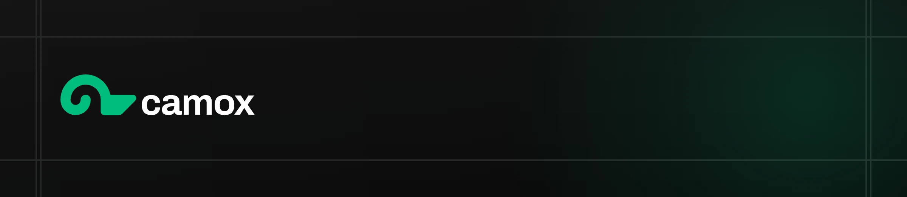

<p align="center">
  
</p>

## The open-source CMS for coding agents

Camox is an open-source page builder framework. It lets developers build quality websites fast by using tools like Claude Code while getting the best parts of a CMS (visual editing, drafts...)

- [Website](https://camox.ai)
- [Video product overview](https://youtu.be/sftAaNrrfR8)
- [GitHub](https://github.com/camox-ai/camox)

## Quick start

```bash
npm create camox@latest
```

## How it works

1. **Create a Camox project**
   Start from the CLI and get a base Camox application on your computer.

2. **Define blocks and layouts in code**
   Blocks are typed React components with content schemas. Layouts describe how
   pages are wrapped with shared structure such as navigation and footers.

3. **Edit content visually**
   Camox Studio lets you inspect pages, select blocks, edit fields, update
   assets, and preview changes in context.

4. **Let agents work through structured tools**
   The Camox CLI and bundled skills let coding agents list pages, inspect block
   types, create sections, update content, and manage draft/live state from the
   terminal.

5. **Publish website-friendly output**
   Camox includes support for SEO metadata, optimized images, Open Graph images,
   and markdown representations of pages for LLM crawlers.

## Features

- **Visual editing** — Use Camox Studio to inspect available blocks, edit their
  content and assets, and preview changes in context.
- **Automatic SEO management** — Camox watches page content changes and can
  generate updated titles and descriptions optimized for search.
- **Draft and publish workflow** — Work on draft content, review changes, then
  publish pages when they are ready to go live.
- **Asset optimization** — Uploaded assets are compressed and served efficiently,
  with AI-generated filenames and alt text for accessibility.
- **Markdown for agents** — Serve token-efficient markdown to LLMs instead of
  raw HTML, with block-to-markdown templates so content keeps its structure.

## Core pieces

- **SDK** — React components, Vite integration, preview tooling, metadata helpers, and the runtime used by Camox apps.
- **CLI** — Terminal commands for inspecting pages, describing block types, editing content, and publishing changes.
- **Studio** — A visual editing interface for the pages and blocks defined by your application.
- **Skills** — Agent-facing instructions that teach coding agents how to create blocks, manage content, and use the CLI.

## License

The Camox framework is MIT-licensed: `camox`, `@camox/cli`, `create-camox`,
`@camox/ui`, `@camox/api-contract`, templates, and supporting packages. The
hosted API implementation in `apps/api` is source-available under [FSL-1.1-MIT](https://fsl.software/).
